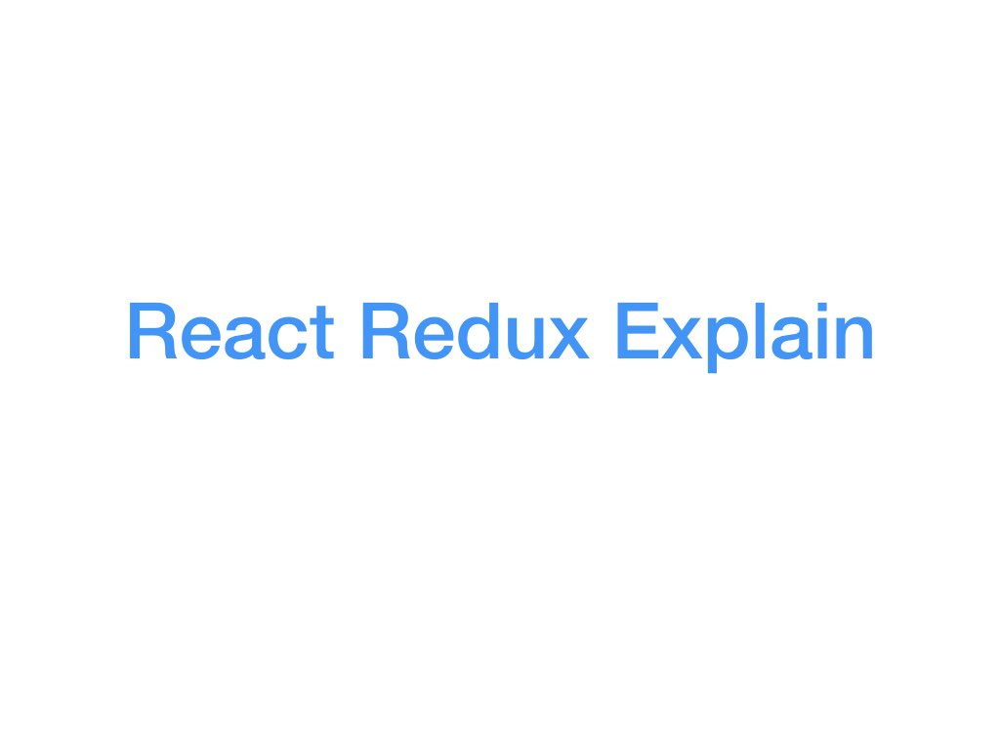
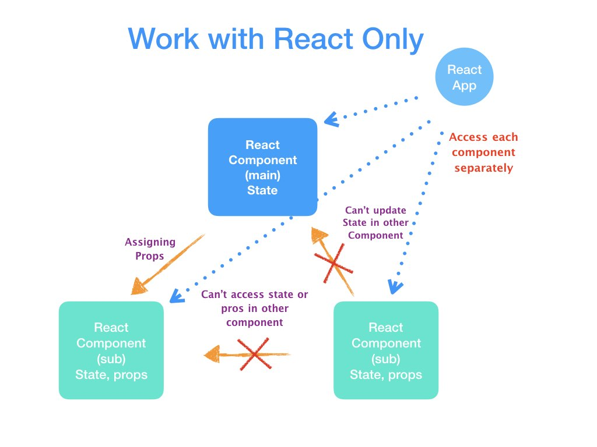
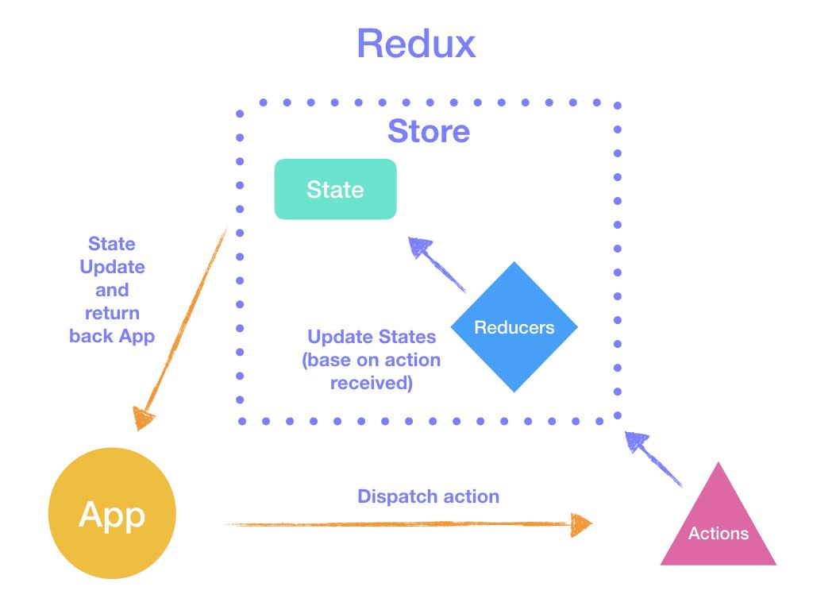
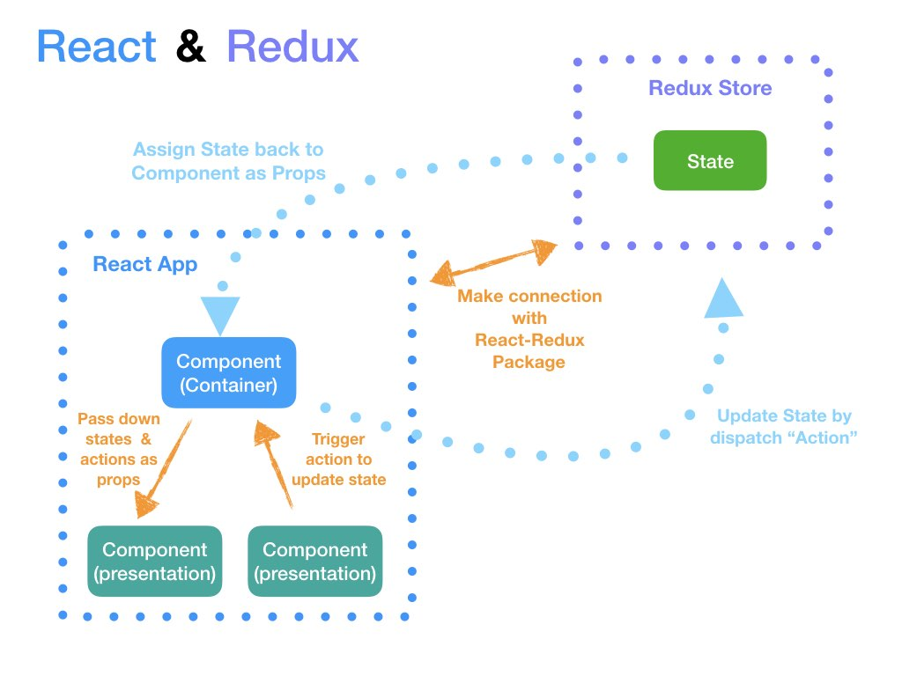

<h1 align="center">📚 Pioneer Bookstore App 📚</h1>
<p align="center">
  
  <a href="https://github.com/kelvin8773/bookstore/blob/master/README.md" target="_blank">
    
  </a>
  <a href="https://github.com/kelvin8773/bookstore/blob/master/LICENSE" target="_blank">
    
  </a>
  <a href="https://twitter.com/kelvin9877" target="_blank">
    
  </a>
  <a href="https://app.netlify.com/sites/pioneer-bookstore/deploys" target="_blank">
    
  </a>
</p>

[](https://bookstore.kelvinliang.cn)

> A React & Redux Boilerplate Project with handcrafted UI design.

### ✨ [Demo Link](https://bookstore.kelvinliang.cn/)

## Tech Stack
* React & redux
* ES6
* SASS

### Tech Explain (State Management in FrontEnd)


> When only have React -


> How Redux manage (without any other framework)


> How React & Redux work together.


[PDF Version](./docs/React_Redux-Explain.pdf)

## Project Development

### 🎬 Install

```sh
yarn install
```

### Usage

```sh
yarn run start
```

### Run tests

```sh
yarn run test
```

## Author

👤 **Kelvin Liang**

* Website: kelvinliang.cn
* Twitter: [@kelvin9877](https://twitter.com/kelvin9877)
* Github: [@kelvin8773](https://github.com/kelvin8773)
* LinkedIn: [@kelvin9877](https://linkedin.com/in/kelvin9877)

## 🤝 Contributing

Contributions, issues and feature requests are welcome!<br />Feel free to check [issues page](https://github.com/kelvin8773/bookstore/issues). You can also take a look at the [contributing guide](https://github.com/kelvin8773/bookstore/pulls).

## Show your support

Give a ⭐️ if this project helped you!

## 📝 License

Copyright © 2020 [Kelvin Liang](https://github.com/kelvin8773).<br />
This project is [MIT](https://github.com/kelvin8773/bookstore/blob/master/LICENSE) licensed.

***
_This README was generated with ❤️ by [readme-md-generator](https://github.com/kefranabg/readme-md-generator)_